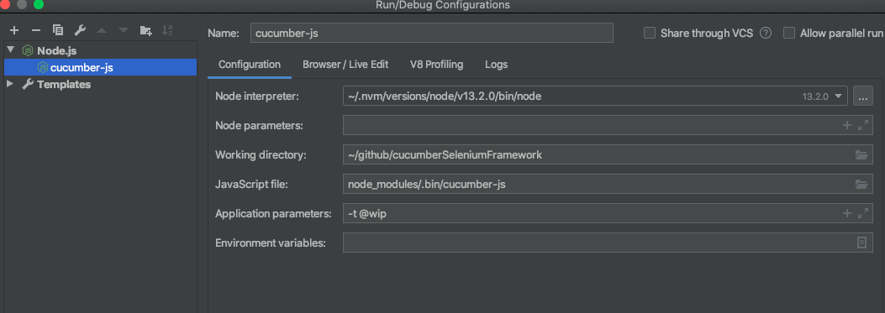

Cucumber Selenium Framework
=================

Sample  Cucumber test framework for Field Nation

Setup
-----

Install NodeJS >=8.3

Make sure you're in the test (`cucumber`) directory and install dependencies:

```shell 
npm install
```

Environment  Variables
---------------------------------
  * ENVIRONMENT - (string) test environment to target, 'local' targets local monolith
  * GRID - (bool) true will use the selenium grid, false will run locally
  * PLATFORM - (string) browser name - chrome, ie, firefox, iPhone 5, etc...
  * SELENIUM_GRID_IP - (string) ip address of the selenium grid
  * CUCUMBER_PARALLEL_WORKERS (cuke_skywalker only) - number of parallel workers

Running Tests
-------------
Environment variables are a big part of configuration how to run the tests

Examples:
Run all tests against local
```shell
ENVIRONMENT=local PLATFORM=chrome node ./node_modules/.bin/cucumber-js
```
or
```shell
npm test
```

Run @wip tests against local
```shell
ENVIRONMENT=local PLATFORM=chrome node ./node_module/.bin/cucumber-js -t @wip
```

This will run all tests against `test2`. The environment and platform are controlled by environment variables.
```shell
ENVIRONMENT=test2 PLATFORM=firefox npm test
```

You can add normal cucumber parameters after a pair of hyphens.
```shell
npm test -- features/workOrders.feature:3
```

Tags
-------------
* @mute - turning off test (any reason other than flakiness)
* @quarantine - turning off flake test

Available Step Definitations
---------------------------------
[See this document](./docs/STEP_DEFINITIONS.md)

Contributing
---------------------------------
TODO

Windows Powershell Users
---------------------------------
1. Install cross-env to set your environment variables ```npm install -g cross-env```
2. If running a specific test tag the test @wip and use ```cross-env ENVIRONMENT=test2 PLATFORM=chrome npm run test-wip```
  *note that you can edit this to your hearts desire in the package.json

Tips
---------------------------------
#### IntelliJ tips ####
* Install the Cucumber Plug-in
    * enabled jump to step definition
* Use Run configs for better debugging
    * 
    * For color output use
```--format-options '{"colorsEnabled": true}'```
    * Note you can only add a breakpoint on javascript code line, just run in debug mode and the test should stop at the break


